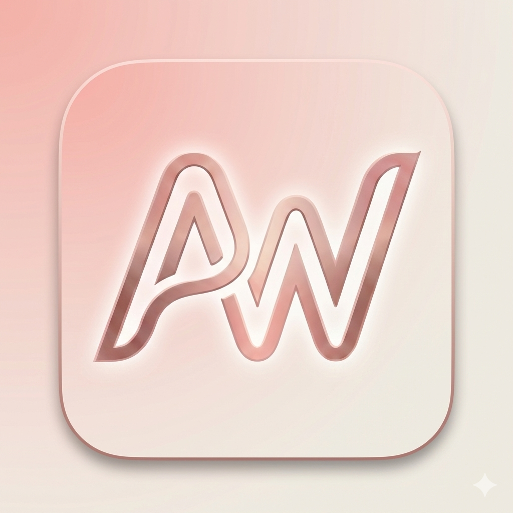

<div align="center">
  
  
  <a href="https://git.io/typing-svg">
    
  </a>

  <p>
    <a href="#"></a>&nbsp;
    <a href="#"></a>&nbsp;
    <a href="#"></a>
  </p>

  ## Aurawear Demo

  **Download the Release Build**
  <br>
  
  <a href="releases/app-release.apk">
    
  </a>
  &nbsp;
  <a href="releases/Aurawear-Windows.zip">
    
  </a>

</div>

<br>

## 📸 Interactive Mockups

<div style="overflow-x: auto; white-space: nowrap; padding-bottom: 20px;">
  
  
  
  
  
  
  
</div>

<br>

## 🎨 Overview

**Aurawear** redefines the mobile shopping experience. Built to showcase the **limitless potential of Flutter**, this project is a high-fidelity UI kit that seamlessly blends sophisticated design with cutting-edge interaction patterns.

It is designed for developers and designers who want to explore **3D optimizations**, **custom rendering**, and **gesture-driven interfaces** without the overhead of backend dependencies.

<br>

<div align="center">
  
  <br>
  <i><b>Official App Icon</b></i>
</div>

<br>

## ✨ Key Features

<table border="0">
  <tr>
    <td width="50%" valign="top">
      <h3>🛍️ Cinematic Shopping</h3>
      <p>A masonry-style feed with hero animations that make product browsing feel like a fluid cinematic experience.</p>
    </td>
    <td width="50%" valign="top">
      <h3>👓 Interactive 3D</h3>
      <p>inspect products in real-time. Rotate, zoom, and explore every detail using our optimized WebGL-based viewer.</p>
    </td>
  </tr>
  <tr>
    <td width="50%" valign="top">
      <h3>🌊 Liquid Onboarding</h3>
      <p>Engage users instantly with a liquid-swipe introduction sequence, powered by custom physics simulations.</p>
    </td>
    <td width="50%" valign="top">
      <h3>🎨 Dusty Rose Design System</h3>
      <p>A meticulously crafted theme using <code>#E35858</code> and <code>#FFE1DD</code>, ensuring consistent typography and color harmony.</p>
    </td>
  </tr>
</table>

## 🛠️ Powered By

<div align="center">
  <br>
  
  
  <br>

  | Core Tech | UI Utilities |
  | :--- | :--- |
  | **Flutter SDK 3.10+** | `model_viewer_plus` (3D) |
  | **Dart 3.0+** | `liquid_swipe` (Gestures) |
  | **Clean Code Principles** | `google_fonts` (Typography) |

</div>

<br>

## 📂 Architecture

Designed for **readability** and **modularity**.

```
lib/
├── core/               # 🎨 Theme, Constants, & Shared Utilities
├── features/           # 📦 UI Modules (Isolated Features)
│   ├── home/           #    - Product Feed & Details
│   ├── onboarding/     #    - Intro Sequence
│   └── splash/         #    - App Initialization
├── app.dart            # 🚀 Root Widget
└── main.dart           # 🏁 Entry Point
```

<br>

## 🚀 Getting Started

1.  **Clone** the repository:
    ```bash
    git clone https://github.com/mzaid-dev/Aurawear.git
    ```
2.  **Install** dependencies:
    ```bash
    flutter pub get
    ```
3.  **Run** on your preferred device:
    ```bash
    flutter run
    ```

<br>

---

<div align="center">
  <br>
  
  <h3>👨‍💻 Crafted with ❤️ by Muhammad Zaid</h3>

  <p>
    <a href="https://github.com/mzaid-dev"></a>
    &nbsp;&nbsp;
    <a href="https://linkedin.com/in/mzaid-dev"></a>
    &nbsp;&nbsp;
    <a href="mailto:dev.mzaid@gmail.com"></a>
  </p>
  
  
</div>
